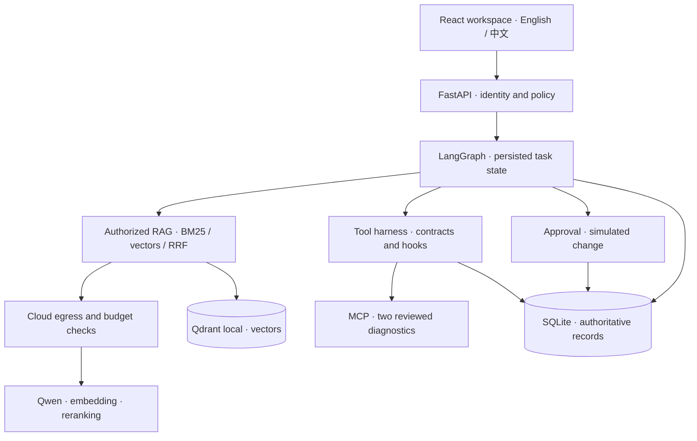

# DeskPilot

**An IT service desk agent with traceable answers, resumable approvals, and governed MCP diagnostics.**

[](https://github.com/shaohsuanw803-boop/deskpilot/actions/workflows/ci.yml)

**English** · [简体中文](README.zh-CN.md) · [Get started](docs/en/getting-started.md) · [Documentation](docs/README.md) · [MIT license](LICENSE)

An employee reports a VPN error. DeskPilot retrieves applicable knowledge, returns source-linked troubleshooting excerpts, and offers a ticket when evidence is insufficient. Software access requests pause for an authorized reviewer and resume from saved state. Resolved tickets can become reviewed team knowledge.

Built as a runnable portfolio project for **VPN troubleshooting, office software support, and software access requests**. Includes a blue-and-white web workspace, fictional data, and a working demo without model API keys. The interface starts in English; select **中文** to switch.

## Engineering highlights

- **RAG with a knowledge lifecycle.** Publication, version, and access checks govern retrieval and citations. Optional cloud retrieval combines BM25, vectors, RRF, and reranking; Qwen selects excerpts that the backend verifies against current sources. [RAG design →](docs/en/rag-design.md)
- **Approvals that survive restarts.** Requests bind parameters and skill versions. Approval consumption, simulated business changes, and idempotency receipts commit in one SQLite transaction. [Workflow source →](backend/deskpilot/workflow.py)
- **MCP inside an execution harness.** Two reviewed tool contracts run through identity binding, schema checks, before/after/error hooks, quotas, deadlines, and a persistent circuit breaker. Tool observations stay separate from knowledge evidence and cloud context. [Harness design →](docs/en/mcp-harness.md)
- **Explicit memory and cost controls.** Task state, confirmed preferences, and reviewed knowledge have separate lifecycles. Context is revalidated on reuse; model calls reserve budgets and keep unknown usage visible. [Memory design →](docs/en/memory-design.md)

## Quick start

Requires **Python 3.11+**, **Node.js 20.19+ or 22.12+**, and npm. No Docker or GPU is required.

```bash
git clone https://github.com/shaohsuanw803-boop/deskpilot.git
cd deskpilot
```

<details open>
<summary>Windows · PowerShell</summary>

```powershell
.\scripts\setup.ps1
.\scripts\start.ps1
```

</details>

<details>
<summary>macOS / Linux</summary>

```bash
bash scripts/setup.sh
bash scripts/start.sh
```

</details>

Open [localhost:5173](http://localhost:5173). Try `Windows 11 Starbridge VPN 5.2 error 809 connection timeout`, then inspect the citations and retrieval trace. The demo runs real local keyword retrieval. Optional MCP preflight uses a real stdio connection with fictional service data. Cloud model calls require configuration; access changes use a clearly labeled simulated adapter.

[Guided demo and troubleshooting](docs/en/getting-started.md) · [Optional Qwen setup](docs/en/provider-setup.md)

## Architecture



| Layer                      | Responsibility                                                          | Start reading                                                                                      |
| -------------------------- | ----------------------------------------------------------------------- | -------------------------------------------------------------------------------------------------- |
| Workspace & API            | Six workspaces, language selection, validation, server-side permissions | [UI](frontend/src/App.tsx), [API](backend/deskpilot/api.py), [policy](backend/deskpilot/policy.py) |
| Workflow                   | Skill versions, task progress, approvals, memory, and recovery          | [workflow.py](backend/deskpilot/workflow.py), [skills.py](backend/deskpilot/skills.py)             |
| Retrieval                  | Document versions, hybrid retrieval, source validation, and degradation | [knowledge.py](backend/deskpilot/knowledge.py), [rag_vectors.py](backend/deskpilot/rag_vectors.py) |
| Execution                  | MCP contracts, hooks, tool limits, model budgets, and usage             | [harness.py](backend/deskpilot/harness.py), [providers.py](backend/deskpilot/providers.py)         |
| Persistence & verification | Authoritative records, rebuildable indexes, regressions, and CI         | [db.py](backend/deskpilot/db.py), [tests](tests), [CI](.github/workflows/ci.yml)                   |

[Business workflow, retrieval flow, and design tradeoffs →](docs/architecture.md)

## Technology stack

| Area                | Technologies                                                           |
| ------------------- | ---------------------------------------------------------------------- |
| Web                 | React 18 · TypeScript · Vite · Lucide · React Markdown                 |
| API & orchestration | Python · FastAPI · Pydantic · LangGraph                                |
| Retrieval & parsing | jieba · BM25Plus · Qdrant local · pypdf · python-docx                  |
| Models & tools      | Qwen · text-embedding-v4 · qwen3-rerank · MCP Python SDK · JSON Schema |
| State & transport   | SQLite · LangGraph SQLite checkpointer · httpx                         |
| Verification        | pytest · Ruff · frontend locale tests · Prettier · GitHub Actions      |

## Measured evidence

Results from the **2026-10-06 bilingual release**; the badge above links to current CI.

| Check                             | Recorded result                                      | Evidence                                                               |
| --------------------------------- | ---------------------------------------------------- | ---------------------------------------------------------------------- |
| Backend regressions               | **104 passed**                                       | [Verification report](docs/reports/bilingual-verification.md)          |
| Frontend locale/API tests         | **6 passed**; TypeScript and production build passed | [Verification report](docs/reports/bilingual-verification.md)          |
| Local BM25 development set        | **Recall@10: 94.44% · MRR@5: 93.06%**                | [Regression and dataset scope](docs/reports/bilingual-verification.md) |
| Paid cloud retrieval / generation | **Unmeasured**                                       | [Evaluation methodology](docs/en/evaluation.md)                        |

The development set has 40 fictional Chinese questions, 36 with answer sources. Retrieval scores are not answer accuracy or production benchmarks. The full corpus has 40 documents and 80 questions split by problem family. Cloud quality, broad cross-language retrieval, and real enterprise MCP integration still require validation.

## Documentation & scope

| Explore                    | Guides                                                                                                                                             |
| -------------------------- | -------------------------------------------------------------------------------------------------------------------------------------------------- |
| Try the app                | [Setup and demo](docs/en/getting-started.md) · [Qwen connection](docs/en/provider-setup.md)                                                        |
| Understand the engineering | [Architecture](docs/architecture.md) · [RAG](docs/en/rag-design.md) · [MCP & harness](docs/en/mcp-harness.md) · [Memory](docs/en/memory-design.md) |
| Reproduce and maintain     | [Evaluation](docs/en/evaluation.md) · [Operations](docs/en/operations.md) · [Implementation status](docs/en/implementation-status.md)              |
| Contribute                 | [Contributing](CONTRIBUTING.md) · [Security](SECURITY.md) · [All documentation / 中文文档](docs/README.md)                                         |

Designed for a local, single-worker demonstration. Identities and access changes are simulated; this is not an SSO deployment or a security/compliance certification. Credentials stay on the backend. Production use needs real identity, isolated execution, managed secrets, network controls, and deployment validation; see [security boundaries](SECURITY.md).
