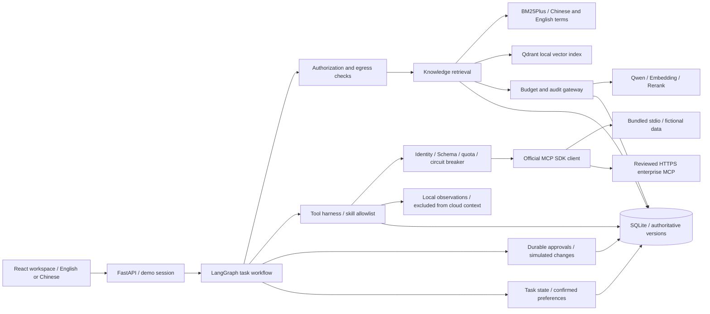
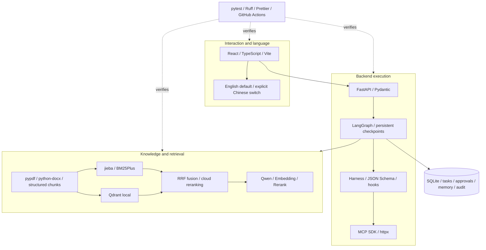
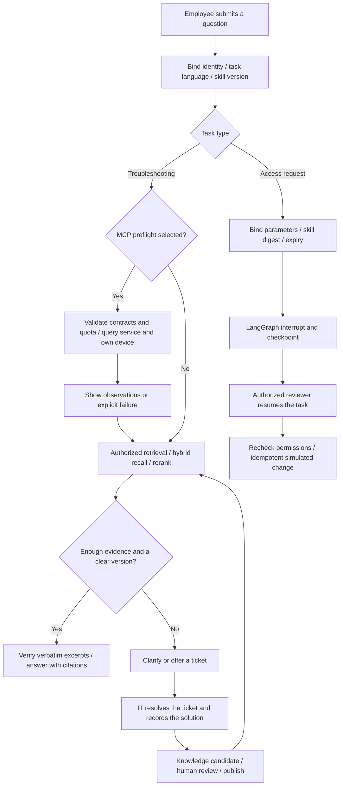
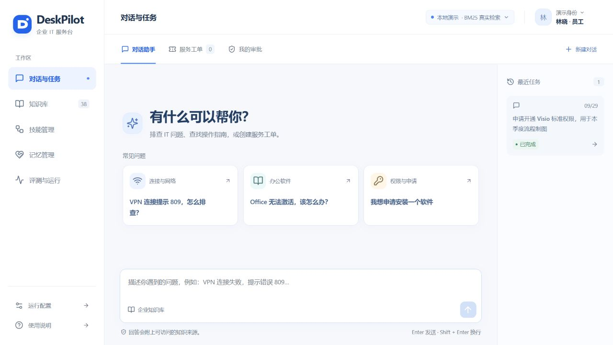

# DeskPilot · Evidence-first IT Service Desk Agent

**English** · [简体中文](README.zh-CN.md) · [Qwen setup](docs/en/provider-setup.md) · [MCP & harness](docs/en/mcp-harness.md) · [RAG](docs/en/rag-design.md) · [Memory](docs/en/memory-design.md) · [Operations](docs/en/operations.md) · [Evaluation](docs/en/evaluation.md)

DeskPilot is a complete agent project that runs on a local computer. It connects IT troubleshooting, verifiable citations, tickets, durable approvals, versioned skills, confirmed personal memory, reviewed team knowledge and cost records. Optional MCP diagnostics add service and device observations through a governed execution harness.

**English is the default interface.** Click **中文** in the header to switch to Simplified Chinese, or **English** to switch back. Only an explicit choice is saved; browser language does not automatically select Chinese. Switching preserves drafts and identity and does not submit actions. New tasks record their response language and retain it when resumed.

Knowledge excerpts, source anchors, user messages, memory text and historical audit facts retain their original text. The bundled 40 documents and 80 evaluation questions are fictional Chinese IT material. Reviewed English product and intent aliases support common questions without a translation service; arbitrary cross-language retrieval quality remains unmeasured.

**This is a portfolio project, not a certified enterprise deployment.** The identity picker is demo authentication; software access changes use a simulated adapter. There are no production account-unlock, email-sending or arbitrary-command tools.

## Run without API keys

Requirements: Python 3.11+, Node.js 20.19+ or 22.12+, and npm. No Docker, GPU or downloaded local model is required.

```powershell
# Windows PowerShell, from the repository root
.\scripts\setup.ps1
.\scripts\start.ps1
```

```bash
# macOS / Linux
bash scripts/setup.sh
bash scripts/start.sh
```

Open [the workspace](http://localhost:5173) and [OpenAPI docs](http://localhost:8000/docs). Stop with Ctrl+C. Setup copies `.env.example` only when `.env` is absent; it does not overwrite credentials or reset data.

```powershell
# Alternatively, start each service separately
.venv\Scripts\python.exe -m deskpilot.cli init
.venv\Scripts\python.exe -m deskpilot.cli serve
# In another terminal
cd frontend
npm run dev
```

`APP_MODE=demo` runs actual local BM25 retrieval, source extraction, authorization, tickets and approvals. Answers contain source extracts. It **does not fabricate embeddings, cloud reranking, model answers or API charges**. Initial seeding does not call cloud providers.

## Architecture

| Layer | Responsibility | Implementation | Boundary |
|---|---|---|---|
| Workspace | Six workspaces, languages, sources and traces | `frontend/src/` | English by default; credentials never enter the browser |
| API and policy | Validation, identity, authorization and egress checks | `api.py`, `policy.py` | Server code enforces permissions, independently of language |
| Agent workflow | Diagnosis, approvals, interruption, resumption and skill versions | `workflow.py`, `skills.py` | Tasks bind identity and versions and persist checkpoints |
| RAG | Parsing, versioning, hybrid retrieval, reranking and citations | `knowledge.py`, `rag_text.py`, `rag_vectors.py` | Only authorized current versions become evidence |
| Tool harness | Allowlist, hooks, contracts, deadlines, quotas and circuit breaker | `harness.py`, `mcp_contracts.py` | External observations do not become cloud context or instructions |
| Connectors and model gateway | MCP, Qwen, embeddings and reranking | `mcp_transport.py`, `providers.py` | Separate credentials, outbound controls, budgets and usage |
| Persistence | Knowledge and task facts, preferences, audit and costs | `db.py`, SQLite, Qdrant local | One backend process; vectors are rebuildable, business records are authoritative |
| Verification | Regressions, evaluation, dependency locks and CI | `tests/`, `scripts/`, `.github/workflows/` | Ordinary CI uses no paid keys; unmeasured capabilities stay explicit |



## Technology stack

| Technology | Use | Practical consideration |
|---|---|---|
| React 18, TypeScript, Vite | Workspace, type checking and builds | Shared language state; no translation API or language autodetection |
| Lucide, React Markdown | Icons and evidence display | Blue-and-white design; external content is not executable authority |
| Python 3.11+, FastAPI, Pydantic | API, configuration and validation | OpenAPI; server-only environment settings |
| LangGraph, SQLite checkpointer | Stateful workflows and approvals | Durable execution instead of a single prompt |
| jieba, rank-bm25 | Chinese tokenization and BM25Plus | Preserve products, versions and error codes; works without keys |
| Qdrant local | Persistent vector index | One client and worker; larger deployments need Qdrant server |
| Qwen, text-embedding-v4, qwen3-rerank | Evidence selection, embeddings, reranking | Separate adapters; region, credentials and prices require configuration |
| Official MCP Python SDK, httpx | stdio and Streamable HTTP | Two reviewed contracts; no arbitrary tools or commands |
| JSON Schema | Tool inputs, outputs and descriptor digests | Detects drift; cannot prove remote behavior is safe |
| SQLite | Knowledge, tasks, approvals, memory, audit and usage | Local source of truth; not tamper-proof or highly available |
| pypdf, python-docx | Text PDF and DOCX extraction | Scanned PDFs require a separate OCR implementation |
| pytest, Ruff, Prettier, GitHub Actions | Tests, linting, formatting and CI | Offline tests do not establish production cloud quality |



## End-to-end workflow



## Six workspaces

| Workspace | What you can demonstrate |
|---|---|
| Conversations and tasks | Clarification, RAG, citations, tickets and persistent execution events |
| Knowledge | Import, review, publish, withdraw and inspect original sources |
| Skills | Ownership, version evaluation and activation |
| Memory | Confirm, edit and delete preferences; resume task progress |
| Connectors and execution | Service and self-device queries, hooks, circuit breaker and admin reset |
| Evaluation and operations | Runs, provider usage, budgets, audit and retrieval traces |

## MCP and harness

The bundled stdio server actually speaks MCP and returns **fictional** service and device data without keys. Select local MCP preflight to run `diagnose-connected@1.0.0`: observations appear separately from reviewed RAG evidence. Failed preflight remains visible and ordinary retrieval continues.

| Control | Implemented behavior |
|---|---|
| Contract | Host allowlist; compare name and input/output schema digests before `tools/call`; annotations do not grant authority |
| Before hook | Identity and self-scope, arguments, task steps, daily quota and circuit check |
| After hook | Deadline, output schema, decoded size, identity match, redaction and local records |
| Error hook | Safe error codes, consecutive-failure circuit breaker, no application-level MCP retry |
| Persistence | Graph checkpoints, approvals, idempotency receipts and tool records; abandoned calls marked interrupted |
| Context | Revalidate source and memory revisions; MCP results never enter cloud model context |
| Delivery | Permission/protocol/failure regressions, dependency locks, offline CI and Git secret scans |

Defaults: 15-second MCP deadline, 16 KiB decoded output limit, 200 daily calls, a 60-second circuit after three failures, and eight tool steps per task. Call quotas are not billing. Only administrators reset the circuit.

Optional Streamable HTTP requires an explicit remote-enable flag, reviewed URL/host and dedicated credential. It accepts a fixed HTTPS/443 host, rejects private DNS results, URL credentials and redirects, and sends a service enum or user ID rather than chat history. Model demo mode and remote MCP are independent switches. [Contracts and remaining risks](docs/en/mcp-harness.md).

## RAG strategy

1. Parse Markdown, TXT, text PDF and DOCX with headings, paragraphs and source anchors. Reject empty scanned PDFs instead of claiming OCR succeeded.
2. Stage revisions and activate on publication. Rebuild indexes when embedding models or dimensions change.
3. Filter by identity, current version and publication state. Cloud processing also requires `cloud_allowed=true` and egress checks.
4. Recall up to 20 candidates each from BM25 and vectors. Fuse using one-based RRF, `k=60`; rerank up to 20 and select up to five chunks plus adjacent context within roughly 4,000 tokens.
5. Qwen selects verbatim evidence in cloud mode. The backend verifies excerpts against authorized current sources. This version does not generate unsupported free-form diagnoses. Missing versions trigger clarification; insufficient evidence offers a ticket path.

Cloud-restricted documents can participate in authorized local keyword retrieval but never cloud embedding, reranking or generation. Provider failure is visibly degraded. Rerank scores are relevance, not answer probabilities. [Full design](docs/en/rag-design.md).

## Connect Qwen / Alibaba Cloud Model Studio

Keep credentials in the server environment or local `.env`. The adapters use separate configuration:

```dotenv
APP_MODE=cloud
LLM_BASE_URL=
LLM_API_KEY=
LLM_MODEL=
EMBEDDING_BASE_URL=
EMBEDDING_API_KEY=
EMBEDDING_MODEL=text-embedding-v4
EMBEDDING_DIMENSIONS=1024
RERANK_ENDPOINT=
RERANK_API_KEY=
RERANK_MODEL=qwen3-rerank
```

Chat/embedding take **base URLs**, reranking a **complete endpoint**. Copy current examples for your region and workspace from the provider console. Configure prices and `PRICE_AS_OF`; unknown usage is not zero cost. [Setup and troubleshooting](docs/en/provider-setup.md).

```bash
# Complete configuration makes three small paid connectivity calls.
# Incomplete configuration is reported without sending requests.
python -m deskpilot.cli check
# Explicit paid embedding step for published, cloud-approved knowledge:
python -m deskpilot.cli index-cloud
```

## Five-minute demo

1. Ask `Windows 11 Starbridge VPN 5.2 error 809: how can I troubleshoot the connection timeout?` Inspect original sources and the retrieval trace.
2. Ask without a client version and observe clarification.
3. Compare restricted knowledge under employee and IT demo identities. Cloud-prohibited content remains local in either case.
4. Request standard Visio access, approve as an authorized reviewer, and inspect audit events.
5. Confirm and delete a personal preference; resolve a ticket and submit knowledge for review.
6. Enable local MCP preflight, compare fictional observations with formal citations, then switch languages without losing a draft.



[Earlier answer screenshot](docs/media/deskpilot-answer.jpg) · [Initial workflow video, older theme, WebM ~14 MB](docs/media/deskpilot-demo.webm)

These historical screenshots predate bilingual support and the MCP workspace. The video shows the initial theme; neither represents the latest interface.

## Verification

The MCP release on 2026-10-06 passed 96 local backend tests, Ruff, dependency checks, TypeScript, Vite and Prettier. Windows/Linux backend and frontend CI passed. These are dated results for that release; language-change results appear in [the bilingual verification report](docs/reports/bilingual-verification.md). [MCP report](docs/reports/mcp-harness-verification.md).

```bash
python -m pytest -q
python -m ruff check backend tests scripts
python scripts/check_secrets.py --history
python scripts/evaluate.py --split dev
# Explicitly permits paid cloud retrieval:
python scripts/evaluate.py --cloud --split test --output docs/reports/cloud-test
cd frontend
npm run build
npm run format:check
```

[Development](docs/reports/retrieval-baseline.md) and [held-out](docs/reports/retrieval-heldout.md) reports contain measured BM25 results. Cloud strategies remain `unmeasured` without APIs. Query families do not cross splits; labels never enter application retrieval. Retrieval metrics are not answer accuracy or enterprise ROI. [Definitions](docs/en/evaluation.md).

The [memory experiment](docs/reports/memory-baseline.md) measures 20 fictional tasks, estimated context size and string-level fact retention, not real-model success or paid savings.

## Layout and operating limits

```text
backend/deskpilot/    API, workflow, policy, RAG, model and MCP adapters
frontend/            React + TypeScript and explicit locale selection
fixtures/knowledge/  40 fictional documents and access metadata
fixtures/eval/       80 family-separated questions and source labels
skills/              Versioned skill manifests
scripts/             Setup, secret scans and evaluation
tests/               Authorization, RAG, providers, workflows, MCP and language
docs/en/             English technical guides
docs/                Chinese guides, dated reports and media
```

- One backend worker; never share Qdrant local storage between processes.
- Demo identities are not SSO, regex checks are not full DLP, and SQLite audit is not tamper-proof.
- Simulated success is not a production account or database change.
- Two reviewed MCP contracts only; no arbitrary tools, OAuth onboarding or enterprise identity mapping. A matching schema cannot prove read-only behavior.
- Output size is checked after SDK decoding. DNS checks need network-level egress controls. Subprocesses are not OS sandboxes; sent requests cannot be recalled.
- MCP observations are local data, not approved knowledge. Interrupted graph preflight may repeat read-only queries; exactly-once reads are not promised.
- Language selection never authorizes translation calls or relaxes permissions, evidence, budgets or approvals.
- Production isolation, retention, managed secrets, immutable audit, penetration testing and compliance acceptance remain future work.

## Secrets and maintenance

`.env`, databases, caches, logs, backups and dependencies stay outside Git. Frontend code never stores provider keys. MCP and Qwen use separate credentials with blank examples. The index/history scanner reports file/line only and has exact path/hash exceptions for verified synthetic fixtures. It is a heuristic, not a guarantee; revoke leaked credentials before cleaning history.

Prefer `uv sync --frozen --extra dev`; the fallback installs `requirements.lock.txt`, then the package with `--no-deps -e .`. Frontend dependencies use the npm lockfile. FastAPI can serve a built `frontend/dist`.

[Operations and rollback](docs/en/operations.md) · [Security](SECURITY.md) · [Contributing](CONTRIBUTING.md) · [MIT license](LICENSE)
