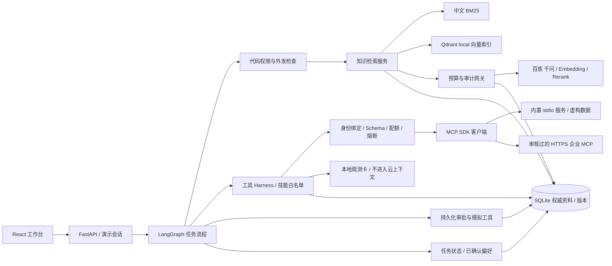
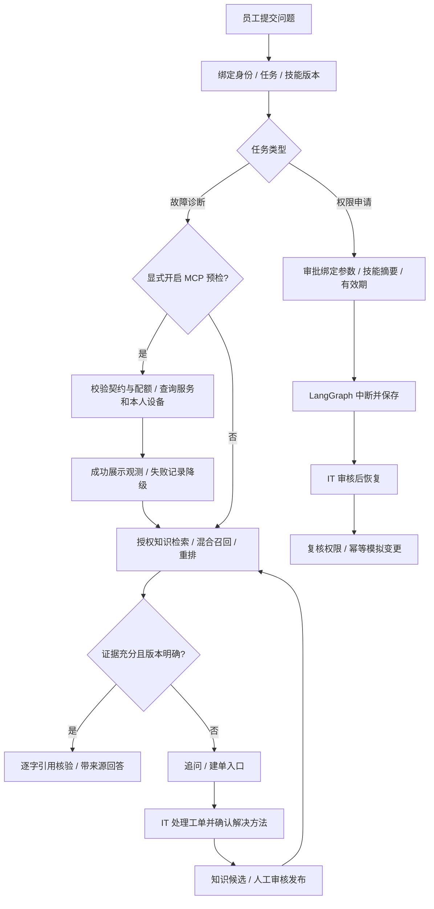

# DeskPilot · 有据可查的企业 IT 服务台 Agent

[English](README.en.md) · [千问 API 接入](docs/provider-setup.md) · [MCP 与 Harness](docs/mcp-harness.md) · [RAG 策略](docs/rag-design.md) · [记忆策略](docs/memory-design.md) · [维护手册](docs/operations.md) · [评测方法](docs/evaluation.md)

DeskPilot 是可在本地运行、适合 GitHub 展示和面试讲解的完整 Agent 作品。它把 MCP 实时观测、IT 问题检索、来源引用、工单、审批、技能版本、记忆和成本记录串成可追踪的流程。技术栈为 Python / FastAPI / LangGraph / SQLite / Qdrant local / 官方 MCP SDK，以及 React / TypeScript / Vite。

它解决一个具体问题：员工问“Windows 11 星桥 VPN 报错 809”，系统寻找适用版本的知识并引用原文；申请软件权限时先形成审批请求；中途关闭会话，再回来仍能看到工单和处理进度。处理经验经审核后进入团队知识库。

**这是本地工程作品，不是已完成企业认证或安全认证的商业产品。** 登录选择器是演示身份切换；软件权限开通使用模拟适配器，没有真实账号解锁或邮件发送连接器。40 篇知识和 80 道评测题全部虚构，不包含真实企业资料。

## 先运行，不需要 API Key

环境：Python 3.11+、Node.js 20.19+ 或 22.12+、npm。无需 Docker，无需 GPU，无需下载本地模型。

```powershell
# Windows PowerShell，在仓库根目录执行
.\scripts\setup.ps1
.\scripts\start.ps1
```

```bash
# macOS / Linux
bash scripts/setup.sh
bash scripts/start.sh
```

打开 [本地界面](http://localhost:5173)，后端 [API 文档](http://localhost:8000/docs)。停止脚本使用 Ctrl+C。安装脚本仅在不存在时复制 `.env.example`，不会覆盖已有 `.env` 或清空数据。

也可以分别启动：

```powershell
.venv\Scripts\python.exe -m deskpilot.cli init
.venv\Scripts\python.exe -m deskpilot.cli serve
# 另一个终端
cd frontend
npm run dev
```

默认 `APP_MODE=demo`：真正执行本地中文 BM25 检索、来源提取、权限检查、工单和审批流程；答案是有来源的摘录。**demo 不会伪造 dense 向量、云重排结果、云模型回答或云端费用。** 缺少云能力时 UI 显示当前模式。

## 切换到千问云端

首个实现提供商是阿里云百炼：千问聊天模型、`text-embedding-v4` 向量、`qwen3-rerank` 重排。三个接口分别配置，支持以后替换适配器。注册、地域、业务空间和报错处理见[接入指南](docs/provider-setup.md)。

```dotenv
APP_MODE=cloud
LLM_BASE_URL=
LLM_API_KEY=
LLM_MODEL=
EMBEDDING_BASE_URL=
EMBEDDING_API_KEY=
EMBEDDING_MODEL=text-embedding-v4
EMBEDDING_DIMENSIONS=1024
RERANK_ENDPOINT=
RERANK_API_KEY=
RERANK_MODEL=qwen3-rerank
```

地址和 Key 故意留空：从你选择地域和业务空间的控制台复制，模型名填写该空间可调用的千问型号。聊天与 embedding 使用兼容接口的 **base URL**，重排使用**完整 endpoint**，不能复制同一个路径。填妥当前地域价格和 `PRICE_AS_OF` 后按顺序执行：

```powershell
# 配置齐全时 check 会真实测试三个接口，产生少量费用；缺配置时不发请求
.venv\Scripts\python.exe -m deskpilot.cli check
# 下面显式为允许外发的已发布知识建立云向量索引，会调用付费 API
.venv\Scripts\python.exe -m deskpilot.cli index-cloud
```

初始 `init` 只做本地 seed，不自动云入库。管理界面的显式连接检查也会发起少量真实请求；所有云调用按供应商规则计费。

## 六个工作区

| 工作区 | 可展示的行为 | 工程边界 |
|---|---|---|
| 任务 | 问题澄清、RAG、来源、工单、持久化执行事件 | Agent 提议操作，代码执行授权；外部写操作为模拟适配器 |
| 知识 | 导入、待审核版本、发布、撤回、来源查看 | SQLite 为权威记录，只有有效且有权的版本可检索 |
| 技能 | 技能负责人、版本评测、激活切换 | 新版本需评测后激活，运行记录关联技能版本 |
| 记忆 | 确认个人偏好、修改、删除、跨会话进度 | 个人偏好与审核后团队知识分开；删除不等于撤回已发出的外部请求 |
| 连接器 | MCP 服务状态、本人设备、执行事件、熔断与管理员重置 | Schema 固定、身份绑定、结果本地隔离；不开放任意工具 |
| 运维 | 调用用量、预算、审计、检索 trace | 未知 usage 保持未知；估算/预算扣减与供应商实际用量分开 |



## 完整业务流程



## MCP 与 Harness 增强

打开“连接器与执行控制”，可以运行两个真实 MCP 工具：`service_status` 查询 VPN/办公/身份服务状态，`asset_lookup` 查询本人设备。内置 stdio 服务提供**虚构数据**，不需要 Key；远程 Streamable HTTP 客户端已实现，但真实企业服务需要配置和联调。

在对话中选择“MCP 预检 → 本地 IT 演示”，输入 VPN 故障，即可看到“外部观测 + 正式知识引用”的双通道结果。MCP 失败时保留明确错误，继续原有 RAG；观测不冒充知识引用，也不自动发送给千问。远程模式只发送所选服务名或当前用户 ID，不发送聊天全文。

Harness 是围绕模型和工具的代码控制层，当前覆盖：

| 控制 | 已实现行为 |
|---|---|
| 工具契约 | 本地白名单；发送工具调用前比较名称、输入/输出 Schema 摘要；不信任服务自报权限 |
| 执行前 hook | 身份与本人范围、参数校验、任务步数、每日调用次数、熔断检查 |
| 执行后 hook | 截止时间、输出 Schema、结果大小、输出身份匹配、脱敏、本地留痕 |
| 错误 hook | 原始异常不落库；连续失败熔断；不自动重试 MCP |
| 持久化与恢复 | 图 checkpoint、审批与幂等凭证、工具运行记录；重启将未完成工具调用标为中断 |
| 上下文控制 | 记忆 revision 与来源依赖重新核验；MCP 结果不进入云上下文 |
| 验证与发布 | 权限/协议/故障回归、依赖锁、无付费密钥 CI、提交内容与历史密钥扫描 |

默认：MCP 总超时 15 秒、解码后结果最多 16 KiB、每日最多 200 次、连续失败 3 次熔断 60 秒；诊断任务总工具步骤仍最多 8 步。配额是次数限制，不能当作远端费用账单。只有管理员能主动重置熔断。

配置独立的 `MCP_REMOTE_URL`、`MCP_REMOTE_ALLOWED_HOST`、`MCP_REMOTE_TOKEN` 并显式开启 `MCP_REMOTE_ENABLED` 后才使用远端。地址不接受前端输入；只允许固定 HTTPS 443 主机，拒绝私网 DNS、URL 内凭据与重定向。详细 Schema、接入步骤、源码分工与边界见 [MCP 与 Harness 手册](docs/mcp-harness.md)。

## RAG 不是“上传文件后随便问”

1. 导入 Markdown、TXT、可提取文本的 PDF 和 DOCX，保留标题、段落与来源锚点；扫描 PDF 不假装已 OCR。
2. 知识先入暂存版本，发布后才参与正式检索；更换 embedding 模型或维度需要重建索引。
3. 按用户和文档状态过滤候选；云端还需 `cloud_allowed=true` 并通过敏感内容检查。
4. 云模式将中文 BM25 与 dense 召回融合，再由 `qwen3-rerank` 重排；原始问题、改写、候选和分数可检查。
5. 千问选择能回答问题的原文，后端逐字核验引用后展示；当前版本不提供无证据的自由改写。版本不明确时先澄清，没有可靠证据时承认不足。

详细策略、中文错误码处理、降级规则和限制见 [RAG 设计](docs/rag-design.md)。

## 五分钟演示路线

[交付状态](docs/implementation-status.md)与[浏览器验收记录](docs/browser-verification.md)区分已实现功能和待验证事项。


[首版流程录屏（旧配色，WebM，约 14 MB）](docs/media/deskpilot-demo.webm) · [查看当前排查回答截图](docs/media/deskpilot-answer.jpg)

截图展示 2026-09-30 的蓝白基础工作台；本次新增第六个 MCP 工作区。录屏保留首版流程与旧配色，不代表当前 UI。

1. 以林晓（产品部）登录，提问“Windows 11 星桥 VPN 5.2 报错 809，连接超时怎么排查？”，打开引用并检查检索 trace。
2. 提问“星桥 VPN 连不上，给我步骤”，观察版本澄清；再提供系统和客户端版本。
3. 尝试检索“IT 专用 VPN 网关事件交接手册”，检查权限隔离。切换陈工后查看对应受限知识，注意该资料仍禁止云发送。
4. 输入“申请开通 Visio 标准权限，用于本季度流程制图”，切换授权审批身份处理，再看事件与审计记录。拒绝和重复审批也应产生明确结果。
5. 保存一条已确认偏好，开启新会话后继续工单；删除偏好后再查看。将解决方案转为候选知识并审核发布。
6. 开启本地 MCP 预检再次提交 VPN 问题；对照虚构服务状态、本人设备和正式知识引用，在连接器页展开执行记录。

## 用测试和实测报告说话

2026-10-06 本机工程回归 **96 项通过**，包括真实 MCP stdio 与远程协议夹具测试；前端类型检查、构建与格式检查通过。范围及限制见 [MCP / Harness 验证记录](docs/reports/mcp-harness-verification.md)。真实企业 MCP 和付费千问效果仍待配置后验证。

```powershell
.venv\Scripts\python.exe -m pytest -q
.venv\Scripts\python.exe scripts/check_secrets.py --history
.venv\Scripts\python.exe scripts/evaluate.py --split dev
# 明确允许付费云调用后，才执行下面命令
.venv\Scripts\python.exe scripts/evaluate.py --cloud --split test --output docs/reports/cloud-test
```

[本地 dev 报告](docs/reports/retrieval-baseline.md)与[冻结参数后的 heldout test 报告](docs/reports/retrieval-heldout.md)包含实际 BM25 数值；未配置云 API 的三条策略为 `unmeasured`，没有伪造对比提升。每题详情在配套 JSON。报告只衡量检索，不能直接等同于生成答案准确率或企业 ROI。

80 个问题包含错误码、Windows/macOS、版本歧义、无答案、ACL 和注入。相同意图的改写归入同一 family，family 不跨 dev/test；gold labels 只存在于评测侧。PR CI 不使用付费 API，云评测通过手动 workflow 和 secrets 执行。

[记忆对照实验](docs/reports/memory-baseline.md)另检查 20 个多轮任务的续办、上下文估算量与字符串事实保留。它不替代真实模型任务成功率，也不把 token 估算当作已发生的 API 费用。

## 项目结构

```text
backend/deskpilot/  API、流程、政策、知识与云适配器
frontend/          React + TypeScript 工作台
fixtures/knowledge/ 40 篇虚构知识与权限元数据
fixtures/eval/      80 个 dev/test 问题及来源标签
scripts/           启动、语料构建与真实服务评测
tests/             授权、生命周期、RAG、提供商与语料测试
docs/              接入、维护、研究、评测报告
```

## 已知边界

- 单机单进程作品，Qdrant local 由一个服务拥有；禁止多个 worker 共享同一索引目录。
- 演示身份不是 SSO；正则外发检查不是完整 DLP；SQLite 审计不是防篡改审计系统。
- 没有真实数据库管理员、邮件发送或账号系统凭据；不可把模拟成功当作实际业务完成。
- 没有完成真实企业部署验收、渗透测试或任何合规认证。生产化前需要另做身份系统、密钥托管、隔离、备份和运营设计。
- 云调用的数据处理范围取决于所选提供商、地域和业务空间；不要导入真实秘密或未经许可的内部资料。
- MCP Schema 匹配不证明远端实现安全；没有任意 MCP 自动接入、OAuth 刷新或多租户身份映射。只支持审核过的两项工具契约。
- MCP 结果上限在 SDK 解码后检查，DNS 检查仍需网络层出站隔离补强；已发送请求无法撤回。子进程不是 OS 沙箱。
- MCP 观测不做模型推理、不自动发布为知识；独立调用重启不重放，图恢复时只读预检可能重新查询。远端写入不在本版范围。

## 密钥与公开发布

`.env`、运行数据库、缓存、日志、备份和依赖目录由 `.gitignore` 排除；前端不保存 API Key。千问和 MCP 使用独立服务凭据，示例只保留空值。提交前运行 `scripts/check_secrets.py` 检查 Git index，发布前加 `--history` 检查提交历史；输出只有文件和行号，不显示密钥。扫描是启发式检查，不能保证发现所有秘密。若已经泄露，先吊销/轮换，单纯删除文件无效。

安装优先使用 `uv sync --frozen --extra dev` 和仓库锁文件；没有 uv 时按 `requirements.lock.txt` 安装，再以 `--no-deps -e .` 安装项目。前端使用 npm lockfile。构建 `frontend/dist` 后后端也可静态托管该目录。

维护责任、发布与回退：[运维手册](docs/operations.md)。安全问题：[SECURITY.md](SECURITY.md)。欢迎基于可复现案例提交改进：[CONTRIBUTING.md](CONTRIBUTING.md)。代码采用 [MIT](LICENSE)，第三方依赖遵循各自许可。
