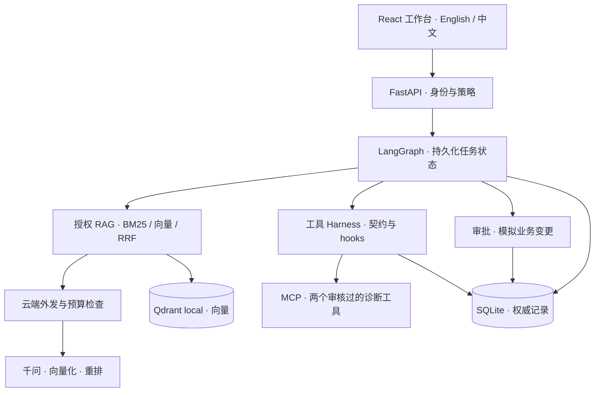

# DeskPilot

**面向 IT 服务台的 Agent：回答可追溯，审批可恢复，MCP 工具执行有边界。**

[](https://github.com/shaohsuanw803-boop/deskpilot/actions/workflows/ci.yml)

[English](README.md) · **简体中文** · [快速开始](docs/getting-started.md) · [文档](docs/README.md) · [MIT 许可证](LICENSE)

员工遇到 VPN 报错，DeskPilot 查找适用知识，给出附带原文引用的排查摘录；证据不足时提供建单入口。软件权限申请交给有权的人员审批，再从保存的状态继续。工单解决后，处理经验可以经过审核进入团队知识库。

这是一个可运行的作品项目，覆盖 **VPN 故障、办公软件支持、软件权限申请**。提供蓝白网页工作台、虚构示例数据和免模型 Key 的演示模式。界面默认英文，点击 **中文** 才切换中文。

## 工程亮点

- **覆盖知识生命周期的 RAG。** 发布状态、版本和访问权限决定哪些资料可被检索与引用。云端可选 BM25、向量、RRF 和重排；千问选择证据摘录，后端再对照有效原文逐字核验。[RAG 设计 →](docs/rag-design.md)
- **重启后可继续的审批。** 申请绑定参数和技能版本；审批消费、模拟业务变更和幂等回执在同一个 SQLite 事务中提交。[工作流源码 →](backend/deskpilot/workflow.py)
- **在 Harness 中执行 MCP。** 两个经过审核的工具契约统一经过身份绑定、Schema 校验、前置／后置／异常 hooks、配额、超时和持久化熔断。工具观测与知识证据分开展示，不进入云端上下文。[Harness 设计 →](docs/mcp-harness.md)
- **明确的记忆与成本控制。** 任务状态、已确认偏好、已审核知识各自管理，复用上下文时重新检查有效性；模型调用前预留预算，缺失用量保持未知。[记忆设计 →](docs/memory-design.md)

## 快速开始

需要 **Python 3.11+**、**Node.js 20.19+ 或 22.12+** 和 npm，无需 Docker 或 GPU。

```bash
git clone https://github.com/shaohsuanw803-boop/deskpilot.git
cd deskpilot
```

<details open>
<summary>Windows · PowerShell</summary>

```powershell
.\scripts\setup.ps1
.\scripts\start.ps1
```

</details>

<details>
<summary>macOS / Linux</summary>

```bash
bash scripts/setup.sh
bash scripts/start.sh
```

</details>

打开 [localhost:5173](http://localhost:5173)，尝试输入 `Windows 11 星桥 VPN 5.2 错误 809 连接超时`，查看引用和检索轨迹。演示模式运行真实本地关键词检索；启用可选 MCP 预检后，通过真实 stdio 连接读取虚构服务数据。云模型调用需要配置，权限变更使用明确标注的模拟适配器。

[演示步骤与启动排查](docs/getting-started.md) · [可选：接入千问](docs/provider-setup.md)

## 架构



| 架构层       | 核心职责                                   | 源码入口                                                                                           |
| ------------ | ------------------------------------------ | -------------------------------------------------------------------------------------------------- |
| 工作台与 API | 六个工作区、语言选择、参数校验、服务端权限 | [界面](frontend/src/App.tsx)、[API](backend/deskpilot/api.py)、[策略](backend/deskpilot/policy.py) |
| 工作流       | 技能版本、任务进度、审批、记忆和恢复       | [workflow.py](backend/deskpilot/workflow.py)、[skills.py](backend/deskpilot/skills.py)             |
| 检索         | 文档版本、混合检索、来源核验和降级         | [knowledge.py](backend/deskpilot/knowledge.py)、[rag_vectors.py](backend/deskpilot/rag_vectors.py) |
| 执行控制     | MCP 契约、hooks、工具限额、模型预算和用量  | [harness.py](backend/deskpilot/harness.py)、[providers.py](backend/deskpilot/providers.py)         |
| 存储与验证   | 权威记录、可重建索引、回归测试和 CI        | [db.py](backend/deskpilot/db.py)、[测试](tests)、[CI](.github/workflows/ci.yml)                    |

[完整业务流程、检索链路与设计取舍 →](docs/architecture.md)

## 技术栈

| 领域       | 技术                                                                   |
| ---------- | ---------------------------------------------------------------------- |
| 网页       | React 18 · TypeScript · Vite · Lucide · React Markdown                 |
| API 与编排 | Python · FastAPI · Pydantic · LangGraph                                |
| 检索与解析 | jieba · BM25Plus · Qdrant local · pypdf · python-docx                  |
| 模型与工具 | 千问 · text-embedding-v4 · qwen3-rerank · MCP Python SDK · JSON Schema |
| 状态与通信 | SQLite · LangGraph SQLite checkpointer · httpx                         |
| 工程验证   | pytest · Ruff · 前端语言测试 · Prettier · GitHub Actions               |

## 实测证据

以下为 **2026-10-06 双语版本**的验证记录；顶部徽章链接到当前 CI。

| 检查                   | 已记录结果                            | 证据                                                         |
| ---------------------- | ------------------------------------- | ------------------------------------------------------------ |
| 后端回归               | **104 项通过**                        | [验证报告](docs/reports/bilingual-verification.md)           |
| 前端语言／API 测试     | **6 项通过**；类型检查和生产构建通过  | [验证报告](docs/reports/bilingual-verification.md)           |
| 本地 BM25 开发集       | **Recall@10：94.44% · MRR@5：93.06%** | [回归结果与数据范围](docs/reports/bilingual-verification.md) |
| 真实付费云端检索／生成 | **未测**                              | [评测方法](docs/evaluation.md)                               |

开发集有 40 个中文虚构问题，其中 36 个具有标准答案来源。检索指标不等于回答准确率或生产性能。完整语料包括 40 份文档、80 个按问题族拆分的问题；云端效果、通用跨语言检索和真实企业 MCP 联调仍需验证。

## 文档与适用范围

| 想了解什么   | 对应文档                                                                                                                               |
| ------------ | -------------------------------------------------------------------------------------------------------------------------------------- |
| 体验项目     | [安装与演示](docs/getting-started.md) · [千问接入](docs/provider-setup.md)                                                             |
| 理解工程设计 | [架构与流程](docs/architecture.md) · [RAG](docs/rag-design.md) · [MCP 与 Harness](docs/mcp-harness.md) · [记忆](docs/memory-design.md) |
| 复现与维护   | [评测](docs/evaluation.md) · [运维](docs/operations.md) · [实现状态](docs/implementation-status.md)                                    |
| 参与开发     | [贡献指南](docs/CONTRIBUTING.zh-CN.md) · [安全说明](docs/SECURITY.zh-CN.md) · [全部中英文文档](docs/README.md)                         |

项目面向本地单 worker 演示，身份和权限变更采用模拟实现，不代表已经接入 SSO 或通过安全、合规认证。凭据仅留在后端。生产部署仍需真实身份、执行隔离、密钥管理、网络控制和部署验证，详见[安全边界](docs/SECURITY.zh-CN.md)。
