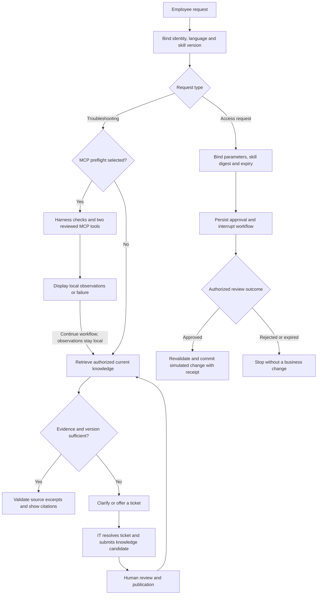
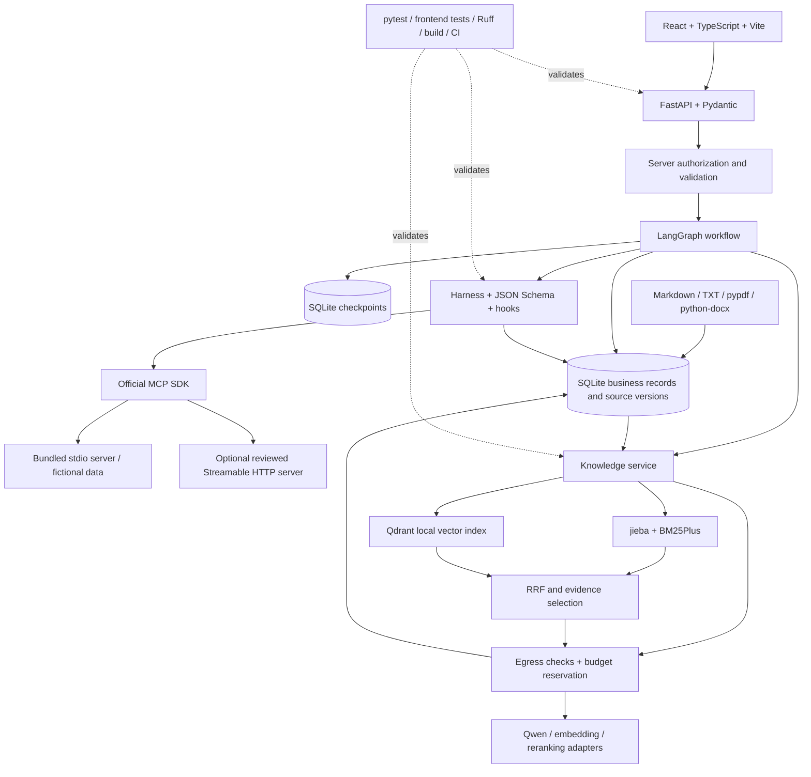

# Architecture / 架构说明

[English README](../README.md) · [中文 README](../README.zh-CN.md)

DeskPilot combines a persistent IT workflow with retrieval and explicit execution controls. The model selects evidence; server code owns permissions, approvals, budgets and tool admission. This guide describes the implemented local application and its boundaries.

## Business flow

An MCP failure remains visible and does not prevent ordinary retrieval. Observations are displayed separately: they are neither formal knowledge citations nor input to the cloud model. Approval rejection and expiry do not execute a change.

## Technology flow

The cloud node represents separate adapters and calls, not one shared API protocol. In demo mode, local keyword retrieval and workflows run without fabricated vector, reranking or model results.

## RAG: bounded retrieval and verifiable evidence

1. **Prepare sources.** Parse Markdown, TXT, DOCX and text PDFs; preserve headings and source anchors. Empty scanned PDFs require OCR rather than being accepted as successful imports. Stage versions before publication and reuse content-hash embedding records where applicable.
2. **Build a scoped query.** Combine the current request with revalidated task context and reviewed product aliases. Preserve error codes, platform and version constraints. Authorization, publication state and active version filter the candidate set before retrieval.
3. **Recall and rank.** Retrieve up to **20 BM25 candidates and 20 vector candidates**. Fuse one-based ranks with **RRF, k = 60**; pass up to **20 eligible candidates** to cloud reranking. Demo mode runs the real BM25 path only.
4. **Bound context.** Select up to **five evidence chunks**, then add authorized adjacent chunks from the same document version. The combined context is limited to roughly **4,000 estimated tokens**. Reranking scores indicate relevance, not answer confidence.
5. **Check the result.** Unmatched technical identifiers or insufficient evidence produce a no-evidence response; conflicting applicable versions request clarification. Cloud Qwen selects source quotes, which the backend verifies verbatim before display. This implementation does not accept unsupported free-form model diagnoses. Provider failures produce a visible degraded result with local excerpts where available.

Documents that prohibit cloud processing participate only in authorized local keyword retrieval. They never enter cloud embeddings, reranking or generation. Context dependencies and source permissions are rechecked before provider attempts and answer display; old task history cannot restore withdrawn evidence. These checks cannot recall a request already sent, and credential-pattern filtering is not comprehensive DLP.

[RAG design](en/rag-design.md) · [Evaluation methodology](en/evaluation.md) · [Implementation](../backend/deskpilot/knowledge.py) · [Regressions](../tests/test_rag.py)

## Harness, approvals and recovery

The harness admits only `service_status` and self-scoped `asset_lookup` through reviewed contracts. Server descriptions and annotations grant no authority. The bundled server uses real MCP stdio with fictional data; the optional remote transport uses Streamable HTTP.

| Stage    | Enforced behavior                                                                                                                                                                |
| -------- | -------------------------------------------------------------------------------------------------------------------------------------------------------------------------------- |
| Before   | Check identity, tool allowlist, input schema, task deadline, step limit, daily quota and circuit state; compare the remote descriptor with the local contract before invocation. |
| After    | Recheck task authority, elapsed time, decoded output size, schema and returned identity; redact and persist the result.                                                          |
| Error    | Persist a safe error category and circuit state. Application-level MCP calls are not automatically retried.                                                                      |
| Recovery | Mark abandoned tool calls interrupted. An interrupted graph node may repeat read-only preflight; exactly-once reads are not promised.                                            |

Access approvals bind the requester, parameters, skill version/digest, policy version and expiry. The simulated business change, consumed approval and idempotency receipt commit in one SQLite transaction. A restart after that commit reads the receipt instead of repeating the change. This guarantee covers the **local simulated adapter**, not a distributed transaction with real enterprise systems or the separate graph checkpoint database.

[MCP and harness guide](en/mcp-harness.md) · [Harness source](../backend/deskpilot/harness.py) · [Workflow source](../backend/deskpilot/workflow.py) · [MCP tests](../tests/test_mcp_harness.py) · [Recovery tests](../tests/test_workflow.py)

## Persistence, memory and cost decisions

Task submission has its own reliability boundary: before parsing, the ASGI middleware limits request bytes, total body reception time, and admitted mutations. A user-scoped submission receipt commits with the task, so an unchanged HTTP retry reads current state instead of invoking the graph twice. [Request and idempotency contract](runtime-reliability.md)

| Decision                       | Why it matters                                                                                                                                                                                                                                                         |
| ------------------------------ | ---------------------------------------------------------------------------------------------------------------------------------------------------------------------------------------------------------------------------------------------------------------------- |
| SQLite owns business facts     | Document versions, tasks, approvals, preferences, usage and audit remain inspectable local records. Graph checkpoints support workflow resumption; they do not replace authoritative source validation.                                                                |
| Qdrant is a rebuildable index  | Vectors must match the embedding model and dimensions. One backend worker and one serialized local client avoid storage contention; this is a small-deployment design.                                                                                                 |
| Memory has distinct lifecycles | Task progress, confirmed personal preferences and reviewed team knowledge are separate. Context is reconstructed from valid dependencies; preference edits/deletions invalidate dependent history through revision checks. There is no automatic paid summary service. |
| Budgets precede provider calls | Every attempt, including bounded retries, reserves budget and rechecks authorization. Reported usage settles costs; missing usage remains unknown with a reservation, not zero. Quotas for MCP calls are not monetary billing.                                         |
| Validation has a defined scope | Offline tests cover policy and failure behavior. Chinese synthetic retrieval reports do not establish real-cloud answer quality, enterprise ROI or production certification.                                                                                           |

[Memory design](en/memory-design.md) · [Provider gateway](../backend/deskpilot/providers.py) · [Provider tests](../tests/test_providers.py) · [Maintenance and production gaps](en/operations.md)

## 中文说明

DeskPilot 用持久化工作流组织 IT 排障、权限申请和知识沉淀。模型负责选择依据，服务端负责权限、审批、预算和工具准入。上面的业务图展示从提问到引用回答、人工工单、审核入库的闭环；技术图展示前端、编排、检索、模型适配器与存储之间的关系。

### 检索与回答

文档先解析、保留章节或页码锚点，再分块、准备版本并审核发布；扫描 PDF 没有可提取文本时会明确失败。查询结合经过重新鉴权的任务背景，保留错误码、平台和版本。候选首先通过身份、发布状态和有效版本过滤，再分别最多召回 **20 条 BM25 与 20 条向量结果**，按一基排名、**k = 60 的 RRF** 融合，最多 **20 条**进入云端重排。

最终最多选择 **5 个证据片段**，补充同一授权文档、同一版本的相邻段落，总量约 **4,000 个估算 token**。版本冲突先追问，未知技术标识或缺少依据时不强行回答。云端千问选择原文摘录，后端逐字校验；当前实现不接受模型自由补充的诊断。服务失败时明确降级，允许时展示本地摘录。演示模式只有真实 BM25，不模拟向量结果或云端效果。

禁止外发的资料只参与授权后的本地关键词检索，不进入云端向量化、重排或回答。历史上下文依赖的来源、访问权限和记忆版本会重新检查，文档撤回后不能借旧上下文重新外发。已发出的请求无法撤回；凭据正则检查也不能替代完整 DLP。

[RAG 设计](rag-design.md) · [评测口径](evaluation.md)

### 执行控制与恢复

MCP 只开放已审核的服务状态查询和当前用户设备查询。调用前检查身份、参数、契约、时限、步骤、配额和熔断；返回后检查结构、身份、解码后大小并脱敏留痕；失败不自动重试，连续失败触发持久化熔断。观察结果留在本地，独立展示，不进入千问上下文，也不充当正式知识引用。契约吻合不能证明远端实现安全；解码后大小限制不是网络层内存上限。

审批绑定具体申请人、操作参数、技能与策略版本及有效期。**本地模拟权限变更、审批消费和幂等凭证在同一个 SQLite 事务提交**，恢复时先检查凭证。这个保证不覆盖真实企业 API 的分布式事务，也不意味着读取只执行一次；中断的图节点可能重新查询只读状态。拒绝或过期的审批不会执行权限变更。

[MCP 与 harness](mcp-harness.md) · [审批和恢复测试](../tests/test_workflow.py)

### 工程取舍

任务提交还有独立的可靠性边界：ASGI 中间件在解析前限制请求大小、完整请求体读取时间和写请求接纳量；用户隔离的提交凭证与任务同事务保存，相同 HTTP 重试读取当前状态，不重复调用工作流。见[入口与幂等契约](runtime-reliability.md#中文说明)。

- **SQLite 保存业务事实，Qdrant 保存可重建索引。** 图检查点单独持久化，不能替代来源有效性检查；本地 Qdrant 使用单 worker、单客户端、串行访问，适合小型部署。
- **记忆分层且有失效规则。** 任务进度、确认偏好和正式团队知识分别管理；偏好修改或删除后，依赖旧版本的历史不能再进入上下文。当前没有自动付费摘要服务。
- **费用按调用尝试记账。** 每次尝试先检查权限并预留预算，供应商返回用量后结算；缺失用量保持未知，不能记成零。MCP 次数配额与模型账单是两回事。
- **验证结果有适用范围。** 自动测试证明的是工程行为，中文虚构语料评测不能代表真实企业效果。演示身份、模拟权限变更、正则脱敏与本地审计还不能代替生产 SSO、隔离、完整 DLP 和防篡改审计。

[记忆设计](memory-design.md) · [维护手册与生产差距](operations.md) · [运行可靠性验证](reports/runtime-reliability-verification.md)
