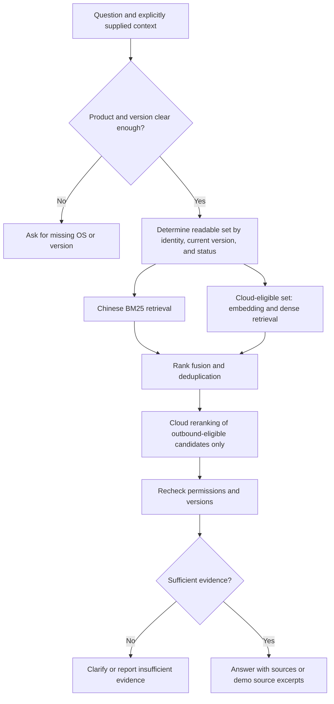

# RAG strategy and implementation boundaries

[Project README](../../README.md) · [中文版](../rag-design.md)

The retrieval design targets a Chinese IT knowledge corpus: find the applicable version, provide inspectable evidence, and stop guessing when information is insufficient. The backend entry point is `KnowledgeService`; model calls go through `ProviderGateway`. Evaluation scripts exercise the actual retrieval service rather than replacing it.

The interface defaults to English and offers an explicit Chinese switch. This changes presentation and subsequent response framing, not the language or content of source documents. Bounded English query aliases support the demo's documented IT intents; they are not a general-purpose translation model or evidence of broad multilingual retrieval quality.

## Index and knowledge lifecycle

- SQLite is authoritative for documents, versions, chunks, import jobs, and permissions. Qdrant local holds only a rebuildable vector index.
- Imported documents first become staged versions. Publishing activates the current version. Once withdrawn, a document cannot serve as valid evidence or an accessible source, even if cached content or old vectors remain.
- Markdown/TXT, text PDFs, and DOCX retain paragraph, heading, and source information after parsing. Scanned PDFs require OCR that this project does not provide; empty extraction cannot count as successful indexing.
- Chunking targets approximately 400 tokens with 60-token overlap. This is a deterministic estimate using Chinese characters and English fragments, not the exact Qwen tokenizer count. Cleaning must retain numeric error codes, English product names, and version numbers. Step anchors let users return to the original source.
- The embedding model and dimensions must match the index. Create or rebuild the index when changing models, then repeat citation and retrieval regressions.

## Query stages

Chinese BM25Plus preserves exact error codes, terminology, and versions; dense retrieval adds semantic matching. Fusion avoids directly comparing incompatible raw scores, while reranking scores the query against candidate passages. Each path retrieves at most 20 candidates. RRF uses `k=60` and retains at most 20 fused candidates. The final five chunks can include adjacent context from the same document and version, with a total limit of approximately 4,000 tokens. After document deduplication, the count can be smaller than the chunk count; do not pad the ranking with unrelated documents to reach ten. Code and traces are authoritative for parameters. Measure changes on the development split, freeze parameters, then evaluate the test split. Never add routing specific to an individual test question.

Restricted documents may participate in local retrieval when the user has access. Access permission and permission to send data to a cloud service are separate decisions. A readable document is not automatically approved for a third-party model. User questions, rewritten context, and candidate text must all pass outbound checks. Retrieved operating instructions are evidence, not new system instructions for the Agent.

## Evidence, degradation, and observability

`search` returns `query`, `rewritten_query`, `status`, `mode`, `evidence`, and `trace`. Evidence includes chunk/document IDs, title, version, anchor, text, and cloud-permission flag. The trace records retrieval paths, candidates, fusion/reranking results, latency, and reasons for degradation.

- `ready`: usable evidence is available to the current identity; this does not guarantee that it solves every real-world issue.
- `needs_clarification`: request required details before, for example, recommending Windows 11 steps to a macOS user.
- `no_evidence`: insufficient support within the currently authorized knowledge scope; create or escalate a ticket.
- `degraded`: a cloud component failed or lacks configuration. Local results can remain available but must be labeled. Evaluation cannot count this as a completed cloud strategy.

Demo answers contain source excerpts, not fabricated model summaries. Cloud Qwen returns structured source IDs and verbatim excerpts. The backend verifies that each quoted span exists exactly in a currently authorized source, then organizes the response into evidence, steps, and next actions. This is model-assisted evidence selection rather than unrestricted generation of diagnoses. Opening a source triggers another authorization check. Regex credential detection is defense in depth, not a complete content-compliance system.

## Single-machine storage constraints

Qdrant local persists through its `path` configuration and takes an exclusive client lock on the directory. Multiple Uvicorn workers or a second indexing process cannot open the same directory concurrently. Filtering is supported, but local-mode payload indexes do not provide server-mode indexing acceleration. This suits a small portfolio application, not a highly available multi-instance database. See the [official Qdrant client documentation](https://github.com/qdrant/qdrant-client).

The demo starts one worker. Import and retrieval coordinate through the instance owned by the service. For multiple processes, machines, or larger datasets, migrate to Qdrant server and revalidate transaction boundaries, index versions, and authorization filters. The project does not add a Docker cluster solely for presentation.
