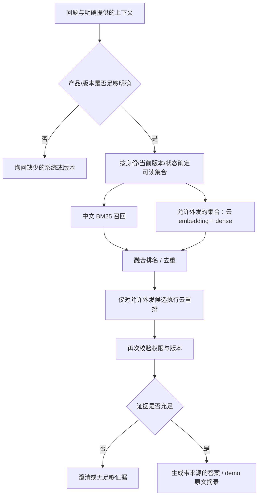

# RAG 策略与落地边界

目标是回答中文 IT 问题时找到适用版本、提供可检查证据，并在不确定时停止猜测。代码入口为后端 `KnowledgeService`，模型通过 `ProviderGateway` 调用，评测脚本不替换实际检索服务。

## 索引与知识生命周期

- SQLite 保存文档、版本、chunk、导入任务及权限，是权威记录。Qdrant local 只保存可重建的向量索引。
- 导入先成为暂存版本，发布后才切换当前版本。撤回后即使缓存或旧向量仍存在，也不能作为有效证据或打开来源。
- Markdown/TXT、文本 PDF、DOCX 解析后保留段落/标题/来源信息。扫描 PDF 没有 OCR 能力，不能把空文本当成功索引。
- chunk 默认按约 400 token 切块、重叠 60 token；这里是中文字符/英文片段的确定性估算，不是千问 tokenizer 的精确值。中文数字错误码、英文产品名、版本号不能在清洗时丢失。处理步骤的来源锚点允许用户返回原文核验。
- embedding 模型和维度必须和索引一致。切换模型时新建/重建索引，再做引用和召回回归测试。

## 查询阶段

中文 BM25Plus 兼顾精确错误码、术语与版本，dense 补充同义表达，融合避免直接比较不可比的原始分数，rerank 对问题与候选段落重新排序。当前每路最多 20 条，RRF 使用 k=60，融合保留最多 20 条；最终 5 个 chunk 加同文档同版本相邻片段，总计不超过约 4000 token。文档去重后的数量可能少于 chunk 数，不能补无关内容凑满 10 篇。参数以代码及 trace 为准；优化必须先在 dev 集测量，再冻结参数评估 test，不针对测试问题写专门路由。

受限文档可以按用户权限参与本地检索，但云许可与访问许可是两个不同判断。员工能读某文档，不代表文档获准发送到第三方模型。用户提问、重写上下文和候选正文都必须经过外发检查。检索到的操作指令是证据，不是 Agent 的新系统指令。

## 证据、降级与观察

`search` 返回 `query`、`rewritten_query`、`status`、`mode`、`evidence` 和 `trace`。证据包含 chunk/document ID、标题、版本、锚点、正文及云许可标记。trace 记录召回分路、候选、融合/重排结果、耗时与降级原因。

- `ready`：当前身份有可用证据；不等于这些证据保证解决所有现实问题。
- `needs_clarification`：先补充必要信息，避免把 Windows 11 步骤给 macOS 用户。
- `no_evidence`：当前授权知识范围中没有足够依据，创建或升级工单。
- `degraded`：云组件失败或缺配置；本地结果可以保留，但必须明确标注，评测不算作完整云策略。

demo 的回答是来源摘录，不是伪造的模型总结。云端千问返回结构化的来源 ID 与原文片段，后端检查引用确实逐字存在于当前授权来源，再组织为依据、步骤和下一步。当前是模型辅助选取证据，不是自由生成故障诊断。来源接口再次检查权限；正则凭据检测只是纵深措施，不是完整内容合规系统。

## 单机存储约束

Qdrant local 的 `path` 会持久化；同一目录被客户端独占锁定，不能由多个 Uvicorn worker 或第二个索引脚本同时打开。过滤可用，但 local 模式的 payload index 不提供服务端索引加速。它适用于这个小型作品，不是多实例高可用数据库。[Qdrant 官方客户端说明](https://github.com/qdrant/qdrant-client)

演示服务只启动一个 worker。导入和检索通过服务持有的实例协调。需要多进程、多机或较大数据量时迁移到 Qdrant server，并重新验证事务边界、索引版本和权限过滤；本项目不为展示目的引入 Docker 集群。
